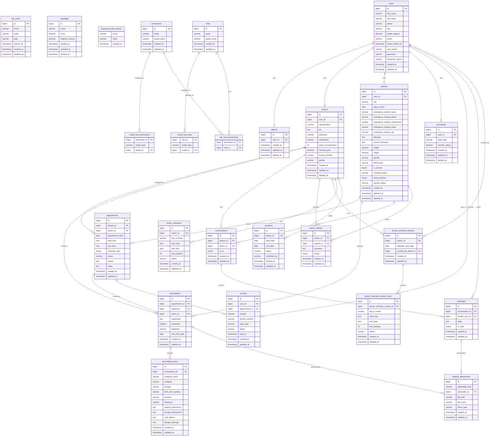

```mermaid
---
config:
  er:
    layoutDirection: TB
  look: handWritten
---

erDiagram
    direction TB
    admins {
        bigint id PK ""
        bigint user_id FK ""
        timestamp created_at  ""
        timestamp updated_at  ""
        timestamp deleted_at  ""
    }

    appointments {
        bigint id PK ""
        bigint patient_id FK ""
        bigint doctor_id FK ""
        date appointment_date  ""
        time start_time  ""
        time end_time  ""
        tinyint reminder_sent  ""
        varchar status  ""
        text reason  ""
        text notes  ""
        timestamp created_at  ""
        timestamp updated_at  ""
    }

    consultations {
        bigint id PK ""
        bigint appointment_id FK ""
        bigint patient_id FK ""
        bigint doctor_id FK ""
        text anamnesis  ""
        longtext symptoms  ""
        varchar diagnosis  ""
        date next_visit_date  ""
        timestamp created_at  ""
        timestamp updated_at  ""
    }

    conversations {
        bigint id PK ""
        bigint patient_id FK ""
        bigint doctor_id FK ""
        tinyint is_ai  ""
        timestamp created_at  ""
        timestamp updated_at  ""
    }

    doctor_reviews {
        bigint id PK ""
        bigint doctor_id FK ""
        bigint patient_id FK ""
        text comment  ""
        tinyint rating  ""
        timestamp created_at  ""
        timestamp updated_at  ""
    }

    doctor_schedule_version_items {
        bigint id PK ""
        bigint doctor_schedule_version_id FK ""
        varchar day_of_week  ""
        time start_time  ""
        time end_time  ""
        int slot_duration  ""
        varchar status  ""
        timestamp created_at  ""
        timestamp updated_at  ""
    }

    doctor_schedule_versions {
        bigint id PK ""
        bigint doctor_id FK ""
        date effective_from_date  ""
        bigint created_by_admin_id FK ""
        timestamp created_at  ""
        timestamp updated_at  ""
    }

    doctor_schedules {
        bigint id PK ""
        bigint doctor_id FK ""
        varchar day_of_week  ""
        time start_time  ""
        time end_time  ""
        int slot_duration  ""
        varchar status  ""
        timestamp created_at  ""
        timestamp updated_at  ""
    }

    doctors {
        bigint id PK ""
        bigint user_id FK ""
        varchar specialization  ""
        text bio  ""
        varchar education  ""
        varchar certification  ""
        int years_of_experience  ""
        decimal session_price  ""
        varchar license_number  ""
        varchar gender  ""
        timestamp created_at  ""
        timestamp updated_at  ""
        timestamp deleted_at  ""
    }

    invoices {
        bigint id PK ""
        bigint user_id FK ""
        bigint appointment_id FK ""
        decimal amount  ""
        varchar invoice_number  ""
        varchar entry_type  ""
        varchar status  ""
        timestamp paid_at  ""
        timestamp created_at  ""
        timestamp updated_at  ""
    }

    medical_attachments {
        bigint id PK ""
        varchar attachable_type  ""
        bigint attachable_id FK ""
        varchar file_path  ""
        varchar file_name  ""
        varchar mime_type  ""
        timestamp created_at  ""
        timestamp updated_at  ""
    }

    messages {
        bigint id PK ""
        bigint conversation_id FK ""
        bigint sender_user_id FK ""
        text body  ""
        tinyint is_read  ""
        timestamp created_at  ""
        timestamp updated_at  ""
    }

    model_has_permissions {
        bigint permission_id FK ""
        varchar model_type  ""
        bigint model_id FK ""
    }

    model_has_roles {
        bigint role_id FK ""
        varchar model_type  ""
        bigint model_id FK ""
    }

    otp_codes {
        bigint id PK ""
        varchar email  ""
        varchar code  ""
        varchar type  ""
        timestamp expires_at  ""
        timestamp created_at  ""
        timestamp updated_at  ""
    }

    packages {
        bigint id PK ""
        varchar name  ""
        decimal price  ""
        decimal balance_amount  ""
        timestamp created_at  ""
        timestamp updated_at  ""
        timestamp deleted_at  ""
    }

    password_reset_tokens {
        varchar email  ""
        varchar token  ""
        timestamp created_at  ""
    }

    patients {
        bigint id PK ""
        bigint user_id FK ""
        varchar city  ""
        date date_of_birth  ""
        varchar emergency_contact_name  ""
        varchar emergency_contact_phone  ""
        varchar emergency_contact_relationship  ""
        varchar emergency_contact_email  ""
        varchar emergency_contact_city  ""
        text allergies  ""
        text chronic_diseases  ""
        decimal weight  ""
        decimal height  ""
        varchar gender  ""
        varchar blood_type  ""
        tinyint is_smoker  ""
        varchar smoking_status  ""
        tinyint drinks_alcohol  ""
        varchar alcohol_status  ""
        timestamp created_at  ""
        timestamp updated_at  ""
        timestamp deleted_at  ""
    }

    permissions {
        bigint id PK ""
        varchar name  ""
        varchar guard_name  ""
        timestamp created_at  ""
        timestamp updated_at  ""
    }

    prescription_items {
        bigint id PK ""
        bigint consultation_id FK ""
        varchar medicine_name  ""
        varchar category  ""
        varchar dosage  ""
        varchar form_and_quantity  ""
        varchar duration  ""
        varchar frequency  ""
        text special_instructions  ""
        text storage_instructions  ""
        text side_effects  ""
        text allergy_warnings  ""
        timestamp created_at  ""
        timestamp updated_at  ""
    }

    role_has_permissions {
        bigint permission_id FK ""
        bigint role_id FK ""
    }

    roles {
        bigint id PK ""
        varchar name  ""
        varchar guard_name  ""
        timestamp created_at  ""
        timestamp updated_at  ""
    }

    secretaries {
        bigint id PK ""
        bigint user_id FK ""
        varchar work_days  ""
        decimal monthly_salary  ""
        timestamp created_at  ""
        timestamp updated_at  ""
        timestamp deleted_at  ""
    }

    users {
        bigint id PK ""
        varchar first_name  ""
        varchar last_name  ""
        varchar phone  ""
        varchar city  ""
        decimal wallet_balance  ""
        varchar email  ""
        timestamp email_verified_at  ""
        varchar user_status  ""
        varchar password  ""
        varchar remember_token  ""
        timestamp created_at  ""
        timestamp updated_at  ""
    }

    vacations {
        bigint id PK ""
        bigint doctor_id FK ""
        date start_date  ""
        date end_date  ""
        varchar status  ""
        varchar submitted_by  ""
        timestamp created_at  ""
        timestamp updated_at  ""
    }

    users||--o|admins:"has"
    users||--o|doctors:"has"
    users||--o|patients:"has"
    users||--o|secretaries:"has"
    users||--o{invoices:"pays_or_receives"
    users||--o{messages:"sends"
    users||--o{doctor_schedule_versions:"created_by"
    doctors||--o{appointments:"assigned_to"
    patients||--o{appointments:"books"
    appointments||--o|consultations:"results_in"
    doctors||--o{consultations:"conducts"
    patients||--o{consultations:"receives"
    doctors||--o{conversations:"has"
    patients||--o{conversations:"has"
    doctors||--o{doctor_reviews:"receives"
    patients||--o{doctor_reviews:"writes"
    doctor_schedule_versions||--o{doctor_schedule_version_items:"contains"
    doctors||--o{doctor_schedule_versions:"has"
    doctors||--o{doctor_schedules:"has"
    conversations||--o{messages:"contains"
    appointments||--o{invoices:"generates"
    permissions||--o{model_has_permissions:"assigned_to"
    roles||--o{model_has_roles:"assigned_to"
    consultations||--o{prescription_items:"includes"
    permissions||--o{role_has_permissions:"belongs_to"
    roles||--o{role_has_permissions:"has"
    doctors||--o{vacations:"takes"
    consultations|o--o{medical_attachments:"polymorphic"
    messages|o--o{medical_attachments:"polymorphic"
```
